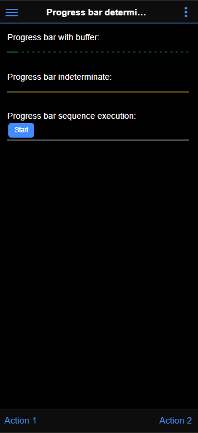

#  progressbar

How to use ProgressBar component

<i>Connectors</i>
<blockquote>

##  void

void connector, replace or don't use it

<i>Transactions</i>
<blockquote>

###  void

does nothing

</blockquote>

</blockquote>

<i>Sequences</i>
<blockquote>

<b>checkStatus</b> : Polled sequence to ckeck main sequence status
<blockquote>

##  checkStatus

Polled sequence to ckeck main sequence status

</blockquote>

<b>main</b> : very long sequence
<blockquote>

##  main

very long sequence

Variables

<table>
<tr>
<th>
name
</th>
<th>
comment
</th>
</tr>
<tr>
<td>
&nbsp;delay
</td>
<td>

</td>
</tr>
</table>

</blockquote>

</blockquote>

<i>Mobile Application</i>
<blockquote>

##  Application

Describes the mobile application global properties

<i>Pages</i>
<blockquote>

###  Page

<h1>ProgressBar usage</h1>
<ul>
<li>First progress bar is of type 'determinate' and positioned in the Toolbar</li>
<li>Second progress bar has a buffer and value incrementing. Color is set to 'success' (green)</li>
<li>Third progress bar is of type 'indeterminate'. Color is set to 'warnning' (orange)</li>
<li>Fourth progress bar is fired with the 'Start' button. It call a 'main' sequence that takes time to execute. It also calls at regular interval another sequence that will give us the main sequence status. Color is set dynamically to different color, depending on the sequence's response.</li>
</ul>

</blockquote>

</blockquote>

